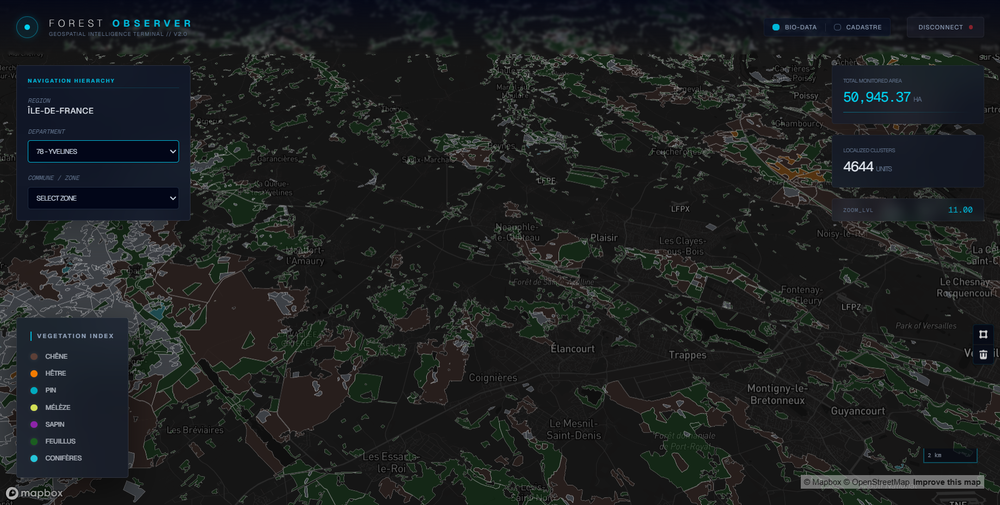
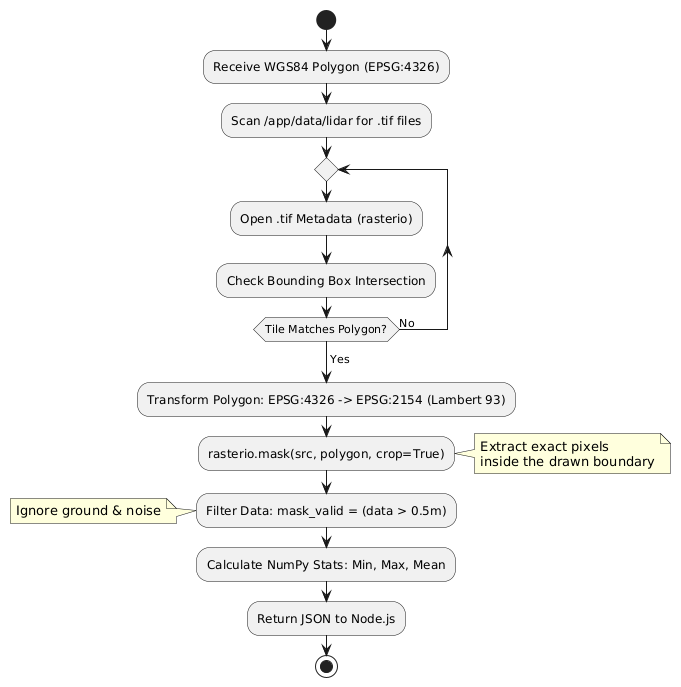
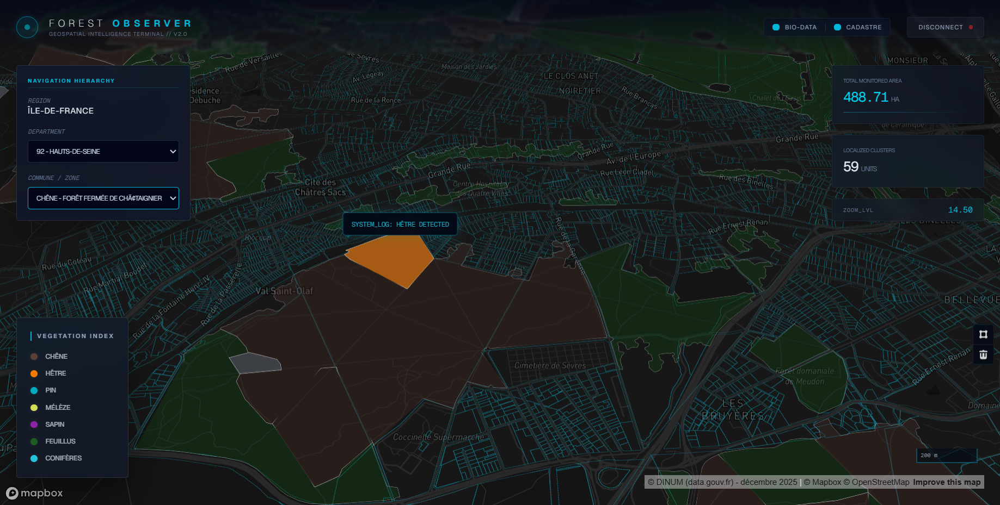
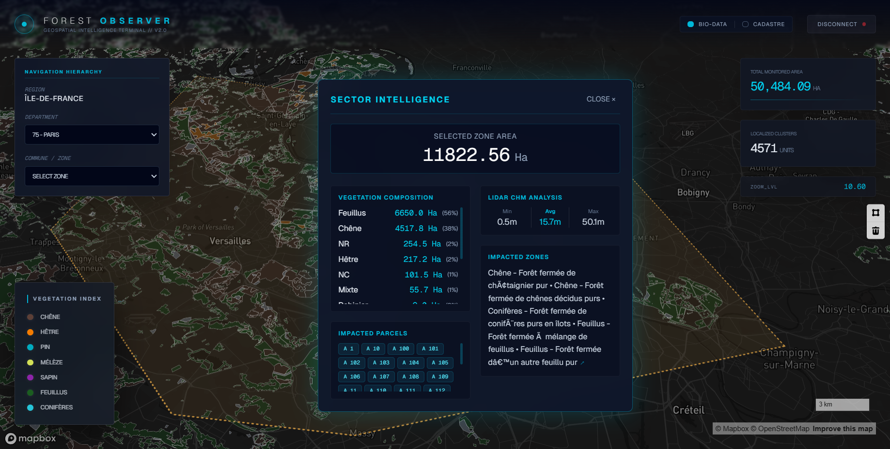
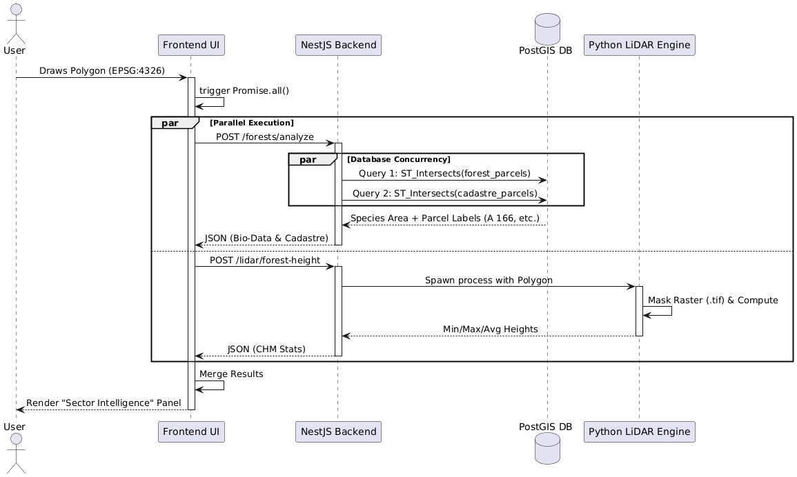
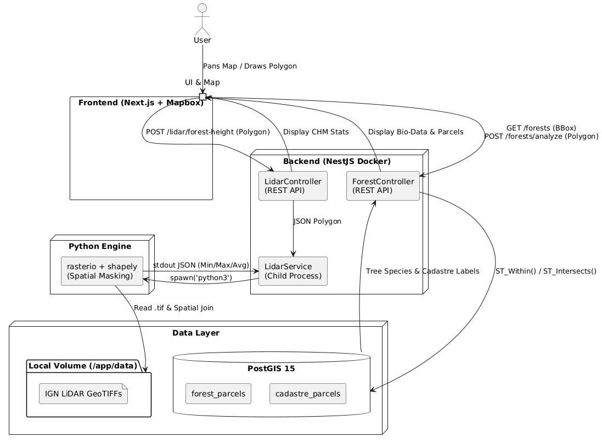

# Symbiose Forest BD Viewer 🌲

<p align="center">
  
</p>

<p align="center">
  <em>Fig 1. The main geospatial intelligence terminal visualizing BD Forêt bio-data.</em>
</p>

A production-ready, full-stack **geospatial intelligence terminal** designed to visualize and analyze French forest data (**BD Forêt**) and **LiDAR canopy heights (CHM)**. Implementation of the **Symbiose Full-Stack Technical Challenge — Forest BD Viewer** (all core + Bonus A/B completed in ~29 hours).

---

## ✨ Features

- **Authentication**: Secure JWT-based registration, login, and session management.
- **Interactive Geospatial Mapping**: Mapbox GL JS integration with a custom *glassmorphism* UI.
- **Macro → Micro Navigation**: Seamless `FlyTo` navigation **Region → Department → Commune**.
- **Vector Layers**
  - **BD Forêt (Bio-Data)**: Tree species visualization filtered dynamically via **PostGIS bounding-box** queries.

    <p align="center">
      
    </p>
    <p align="center">
      <em>Diagram — Bounding box query logic with viewport guard + debounce.</em>
    </p>

  - **Cadastre**: Official **Etalab** vector tiles (TileJSON), loaded at `minzoom: 13`.
- **State Persistence**: Debounced saving of user map view (**latitude / longitude / zoom**).
- **Bonus A — Polygon Spatial Analysis (Backend ST_Intersects)**: Real-time, exact spatial intersections executed in PostGIS. It computes vegetation composition (area per species) and accurately identifies official Cadastre Parcel IDs (e.g., `75101000AS0012`) completely on the server-side, avoiding frontend rendering inaccuracies.
- **Bonus B — LiDAR CHM Integration**: Python-based spatial indexing + masking engine to extract localized CHM stats (**min / max / avg heights**) directly from IGN GeoTIFFs.
- **High-Performance ETL Pipeline**: Implemented a memory-efficient data ingestion pipeline using `stream-json` and `stream-chain` with backpressure support. This allows processing massive GeoJSON datasets (hundreds of thousands of parcels) with a constant, minimal memory footprint (< 100MB).

  <p align="center">
    
  </p>
  <p align="center">
    <em>Diagram — Dynamic CHM masking pipeline (Node ↔ Python ↔ GeoTIFF) and statistics extraction.</em>
  </p>

---

## 🖼️ Screenshots

### Micro-Detail & Cadastre

<p align="center">
  
</p>

<p align="center">
  <em>Fig 2. Micro-level navigation with official Etalab Cadastre vector tiles and hover states.</em>
</p>

### Sector Intelligence (Polygon + LiDAR)

<p align="center">
  
</p>

<p align="center">
  <em>Fig 3. Real-time geometric intersection and LiDAR Canopy Height Model (CHM) spatial masking.</em>
</p>


### Concurrent Spatial Analysis

<p align="center">
  
</p>

<p align="center">
  <em>Diagram — Parallel execution engine: Concurrent PostGIS ST_Intersects queries combined with Python Rasterio spatial masking.</em>
</p>


---

## 🛠 Technology Stack

- **Frontend**: Next.js 15 (App Router), React, Mapbox GL JS, Tailwind CSS  
- **Backend**: NestJS, TypeORM, PostGIS (PostgreSQL 15)  
- **Data Engineering**: Python 3, Rasterio, Shapely, NumPy, GDAL  
- **DevOps**: Docker, Docker Compose, Monorepo structure  

<p align="center">
  
</p>

<p align="center">
  <em>Diagram — The Architecture Flow (full-stack data flow & component collaboration).</em>
</p>

---

## 📂 Project Structure

```text
Symbiose-Forest-Viewer/
├── backend/
│   ├── src/
│   │   ├── auth/              # JWT Authentication & Guards
│   │   ├── forest/            # PostGIS Entities & Spatial Controllers
│   │   ├── lidar/             # Python ↔ Node.js bridge for raster analysis
│   │   ├── scripts/           # ETL pipelines (seed-forest.ts)
│   │   └── main.ts            # NestJS entry point & Swagger config
│   ├── Dockerfile             # Node (Alpine) + Python/GDAL environment
│   └── package.json
├── frontend/
│   ├── app/                   # Next.js routes & layouts
│   ├── components/            # React UI components & Mapbox logic
│   ├── lib/                   # API interceptors & auth utils
│   ├── Dockerfile             # Multi-stage Next.js build
│   └── package.json
├── data/                      # ⚠️ Ignored in git; must be created manually
│   ├── BDV2/                  # BD Forêt Shapefiles (.shp, .dbf, .prj)
│   ├── CPL/                   # French Cadastre GeoJSONs (*-parcelles.json)
│   └── lidar/                 # IGN LiDAR HD GeoTIFFs (.tif)
├── public/
│   └── docs/                  # ✅ README images & diagrams (tracked in git)
├── docker-compose.yml         # Container orchestration
└── README.md
```

---

## 🚀 Getting Started

### Prerequisites

- **Docker** and **Docker Compose**
- A valid **Mapbox access token**

---

### 1) Data Preparation

Due to the large size of the datasets, they are not included in the repository.

1. Create a `data/` directory at the root of the project.
2. **BD Forêt (Core)**  
   Download the shapefiles from **https://geoservices.ign.fr/bdforet#telechargementv2** and place them in:
   - `./data/BDV2/`
3. **LiDAR**  
   Download Cadastre files (cadastre-XX-parcelles.json) from **https://cadastre.data.gouv.fr/data/etalab-cadastre/2025-12-01/geojson/departements/** and place them in:
   - `./data/CPL/`
4. **LiDAR (Bonus B)**  
   Download **MNH GeoTIFF** files from **https://cartes.gouv.fr/telechargement/IGNF_MNH-LIDAR-HD** and place them in:
   - `./data/lidar/`

---

### 2) Environment Setup

Create a `.env` file in `./frontend` (or export the variable in your shell):

```bash
NEXT_PUBLIC_MAPBOX_ACCESS_TOKEN=pk.your_mapbox_token_here
```

---

### 3) Build & Run

Start the full stack (PostGIS, NestJS + Python engine, Next.js) using Docker Compose:

```bash
docker-compose up --build -d
```

---

### 4) Database Seeding (ETL)

Once containers are healthy, run the ingestion script to:

- parse shapefiles
- convert coordinates **EPSG:2154 → EPSG:4326**
- seed the PostGIS database

```bash
docker exec -it nest_backend pnpm run seed:forest
```

---

### 5) Access the Platform

- **Frontend Web App**: `http://localhost:3001`  
- **Backend Swagger API Docs**: `http://localhost:3000/api`

---

## 📖 API Notes

The application exposes **RESTful APIs** documented via **Swagger** at:

- `http://localhost:3000/api`

This includes endpoints for:

- user authentication
- bounding-box forest queries
- LiDAR spatial triggers

**Note:** REST was chosen over GraphQL to optimize streaming of **binary / GeoJSON** payloads between Mapbox and PostGIS.

---

## 🧠 Assumptions & Simplifications

To keep performance strong and respect hardware limits:

- **Cadastre Data Scope & ETL Pragmatism**: Due to the massive volume of cadastral data (e.g., Department 77 contains over 416,000 parcels and exceeds standard Node.js memory limits during standard JSON parsing) and the exercise's time constraints, **the Cadastre database seeding is intentionally restricted to departments 75 and 92**. This aligns perfectly with the available LiDAR data (Bonus B) localized in Paris, ensuring a complete, high-performance demonstration of the "Sector Intelligence" features without unnecessarily bloating the spatial indexes.
- **Parallel Spatial Execution**: When a user draws a polygon, the frontend triggers a `Promise.all` execution. The NestJS backend concurrently queries the `forest_parcels` and `cadastre_parcels` via PostGIS, while the spawned Python child process simultaneously masks the LiDAR `.tif` files.

- **Viewport Guard**: Forest polygons are requested only when `zoom >= 10.5` to avoid browser rendering bottlenecks and heavy DB loads.
- **LiDAR Lazy Evaluation**: Rather than ingesting `50GB+` of GeoTIFFs into PostGIS, the Python Rasterio engine performs **on-the-fly masking** on raw files mounted as a Docker volume. It scans the directory and selects the intersecting tile based on user polygons.
- **Demo Scope**: Forest/LiDAR ETL is configured for departments **75, 77, 78, 91, 92** (Cadastre seeding is intentionally limited to **75 & 92** for performance).

---

## ⏱️ Time Estimate

- **Core** (Auth, Map, API, DevOps): ~16 hours  
- **Bonus** (Polygon Analysis, LiDAR Data Engineering): ~13 hours  
- **Total**: ~29 hours

---

## 🚀 Future Outlook & Roadmap

The current implementation is fully functional locally via Docker Compose and demonstrates production-grade architecture (PostGIS spatial queries, JWT security, on-the-fly LiDAR raster masking, real-time GeoJSON streaming, etc.).

### Remote Deployment (Production-Ready Plan)

Full remote deployment of this full-stack geospatial application (Next.js frontend + NestJS backend + PostGIS database + Python LiDAR engine) is completely understood and ready to execute. The planned production setup would include:

- **Frontend**: Vercel (zero-config Next.js hosting, automatic CI/CD from GitHub, global CDN for Mapbox tiles)
- **Backend**: Render / Railway / Fly.io (Node.js Web Service with persistent disk for Python/GDAL dependencies)
- **Database**: Render PostgreSQL (with PostGIS extension enabled via `CREATE EXTENSION postgis;`) or Supabase (managed PostGIS)
- **Data Volumes**: Persistent storage for LiDAR GeoTIFFs (Render Disks / S3-compatible bucket) to avoid re-downloading
- **Environment Variables**: Secure management of `NEXT_PUBLIC_MAPBOX_TOKEN`, `JWT_SECRET`, `DATABASE_URL`, etc.
- **CI/CD**: GitHub Actions workflow for automated build/test/deploy on push to main
- **Scaling Considerations**: Horizontal scaling for backend (multiple instances), Redis for caching bbox queries if traffic grows

**Why not deployed for this submission?**  
Due to the significant data volume (BD Forêt shapefiles + multiple LiDAR HD GeoTIFF tiles for departments 75/77/78/91/92, totaling several GB even for subset), free-tier resources (Render/ Vercel free plan limits on storage, bandwidth, and build time) do not support reliable long-term hosting without suspension or quota exhaustion during evaluation.

The local Docker setup provides a complete, reproducible demonstration environment that fully satisfies the challenge requirements (“a working local setup via Docker is also fine”).

Production deployment (with proper paid tier or self-hosted VPS) would be straightforward and can be completed in under 2 hours once data is optimized or moved to cloud storage (e.g., S3 + CloudFront for tiles).

Future production version would include:
- Auto-scaling + CDN for heavy raster/GeoJSON payloads
- Monitoring (Sentry + Prometheus)
- Backup strategy for PostGIS + LiDAR files

This project is architected with production deployment in mind from day one.

